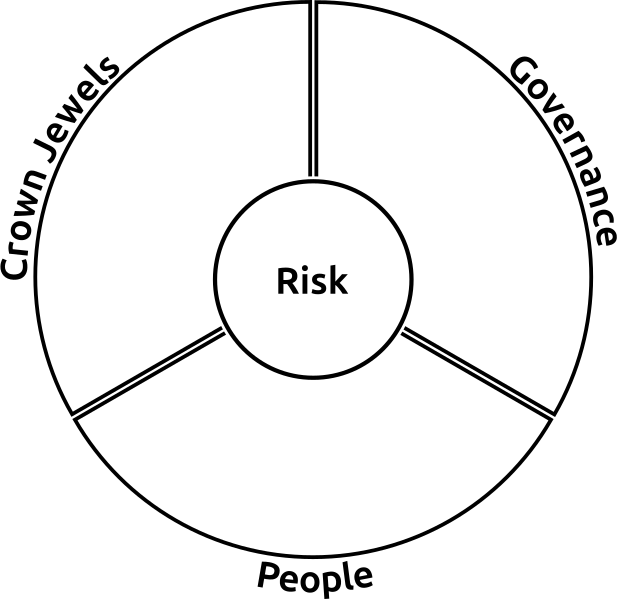
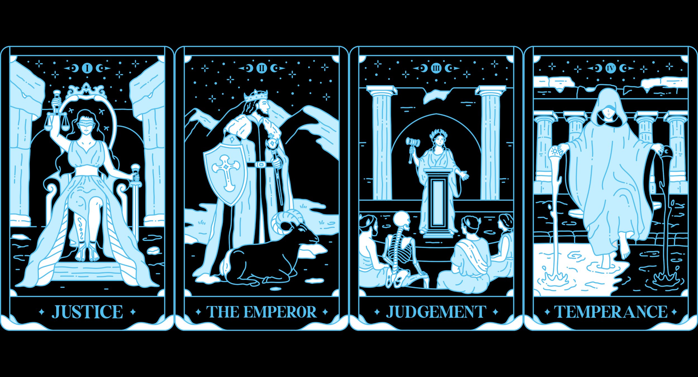
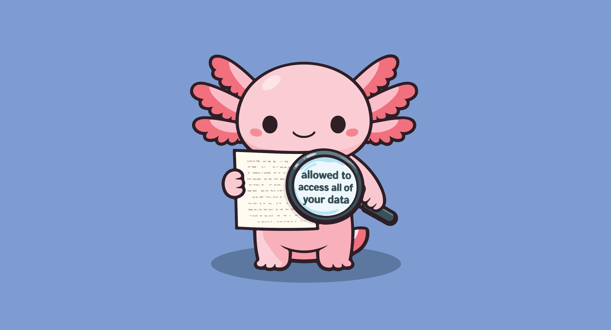

# Simplified Decision Framework (SDF)

The purpose of this Simplified Decision Framework is to assist Information Security, Information Technology, and GRC professionals on leveraging a simple method to improve and expedite decision making capabilities. This practical framework narrows decision-making down to three core concepts aimed at helping teams avoid analysis paralysis while maintaining alignment with organizational objectives, people capital, and governance requirements.

  

# Table of Contents

# Executive Summary

Across the Information Technology (IT) and Information Security (InfoSec) fields decision makers struggle to ensure their projects, processes, and deployments meet the needs of the larger organization. Key decision makers from Governance, IT, and Information Security teams need to ensure they are aligning these complex choices with risk, governance, and staffing while supporting efforts to drive innovation and meet business needs. Making these key decisions often requires an element of agility and expedition as priorities shift in a modern business environment which can lead to non-conformance, deployment failure, and the introduction of organizational risk. It’s easy to become overwhelmed by daily tasks and fall into analysis paralysis or decision fatigue – especially when tackling complex initiatives like selecting a SIEM, building an AI policy, or creating proactive security plans. This Simplified Decision Framework (SDF) aims to ensure alignment with the organization's needs while increasing the timeliness of decision-making.
The SDF is designed to be a practical tool built around three core questions that will guide leaders through the decision-making process. What governs you, what are your “crown jewels”, and what staff do you have? By identifying these three key elements that we refer to as the big W’s and mapping how they are influenced by organizational risk, leaders can ensure their decisions align with organizational risk profiles while supporting speed and innovation. 
1. What are your “crown jewels”?
1. What governs you?
1. What staff do you have?
 
The SDF is designed to be flexible and agile, allowing it to be tuned accordingly for large scale as well as day-to-day decisions.  This documentation outlines the core components and concepts of the SDF. Each of the big W’s will be outlined in detail to allow practitioners to understand the relevance and importance of each of these core components. It also includes guidance for identifying and mapping organizational risks to the framework. Additionally, included are Guiding Principles, Compliance Mapping, and Implementation Guides.
Learning to adapt these simple, practical tools to your organization’s decision-making efforts and lifecycles will help Governance, IT, and Information Security leaders make effective decisions.

# What Are The Components of The SDF?

  

# What Governs You?

  

Governance is more than just the needs of a single department inside of an organization. Governing requirements can come from multiple business units and functions of an organization. The governance principles, requirements, and frameworks used to guide the business should also guide your decision making. To start understanding what governs you, you need a firm understanding of any legal, industrial, or business requirements your organization must follow. Knowing the governance principles and using them to guide your decision making will ensure your new program, project, or decision will be optimally beneficial to the organization while avoiding pitfalls that could cause compliance, financial, or legal issues.  

Governance may impact your decision-making in various ways. For example, identifying requirements outlined in your organizations legal requirements, business agreements, or industry frameworks may outline restrictions preventing the usage of certain tools and services. Organizational policy may limit third parties to geographical locations which could restrict vendor selection pools. Usage of AI may be strictly prohibited by client business agreements preventing its usage in various processes. Whether you are selecting software, testing the efficacy of a new process, modifying a policy, or planning a new company initiative, understanding the requisite governance components will ensure your alignment with organizational standards, needs, and agreements. Failure to align to these requirements could lead to legal action (against yourself or the organization), introduce unacceptable risk, or cause reputational damage. 

# What Are Your "Crown Jewels"?

  

Unlike Governance, your Crown Jewels can be a combination of business specific and decision or project specific assets. To start understanding your Crown Jewels identify key revenue generating staff and services, review where key data for business operations is stored and managed, and review how your organization interacts with your customers. Organizational Crown Jewels are easily identified as general, tier 1, or required assets to keep the business going. Think of these as the items that would have the largest score on your Business Impact Analysis or the items you would focus on first as part of your Business Continuity Plan. Project or decision specific Crown Jewels may cross over with the above but may be scoped to include down or upstream effects to primary Crown Jewels. Crown Jewels are a unique component in the SDF, as your Crown Jewels may also contain people which may or may not be captured in your People section of the framework (e.g., VIPs). 

Crown Jewels are the crux of your decision-making process and act as your key areas of focus (or in some cases avoidance). For example, coordinating an office relocation may create a technical and security risk to all employees during the time between offices. As a result, the whole staff becomes in scope as tier 1 assets through the conclusion of the project. Identifying the impact on Crown Jewels as a key element of decision making ensures your decisions and deployments will enrich organizational workflows and objectives while avoiding pitfalls that could lead to disruption in organizational operations. Appropriate understanding and consideration of Crown Jewels will also help you avoid decisions that could have budgeting, and trust impact to the larger business. 

# What People Do You Have (And What Are Their Skill Sets)?

  

An understanding of appropriately trained staff with skills related to your decision, process, or project can help ensure the success of your project. Understanding your resources pre, during, and post deployment will allow you to modify your scope and ensure a process or deployment isn’t left with no support once it goes live. Missing the mark on this W could lead to damage to your reputation within the organization or insecure deployments lacking staff to run them. A great example would be attempting to deploy a SIEM with limited staff. You may be able to use sales engineers to help ingest everything but without resources to continue tuning, monitoring, and responding to the alerts generated by the SIEM you could end up with a costly project with no real organizational benefit. In that case instead of bringing your SIEM in house your staffing may be better suited for outsourcing you SIEM. When in the early stages of decision making or deployment planning identify what staff you will need to implement your solution or plan. During a large scale implementation or deployment you may needs specially trained staff like engineers, data base administrators, System Administrators, network engineers, or Analysts. Post deployment or decision you may need additional staff to cover alerts, tune data ingestion points, or drive process. Its important to remember that staff considerations can fall outside of your organization. You may require the help of an managed service provider or specialty engineering vendor. Understanding your need for these external entities will help you down the road when you start scheduling and budgeting. You may also find you need support from entities inside your own organization. If the scope of your decision, process, or deployment effects other groups inside the organization you may need their help or support. There may be instances where Finance, Customer Service, Human Resources, and various C Level members will be directly impacted by your project. They may also become valuable members of your active team. One example of this may be when implementing a incident response plan the security or information technology teams may need to coordinate with groups like Legal and Marketing to provide organizationally approved updates to customers. When making a decision or deploying a new project or process its key to understand the staff involved from top to bottom. Going into your decision making process armed with this knowledge will help keep you focused on your scope, help you understand your capabilities, and optimize your chances for success. 

# The Role Of Risk

  

Risk sits at the center of our Simplified Decision Framework because its the core and driving factor for everything we do in Information Security and Technology. Our role is to innovate or assist with innovation by ensuring key members of our organization can do their work in a safe and compliant manner.
## Pitfalls of Risk

  

A key element when we discuss risk is to remember organizational risk does not always equate to what cyber security or technology focused teams consider vulnerabilities. While bad actors, compromised equipment, and vulnerable software could all fall in to the risk category organizational risk covers so much more. Risks impact our organizations ability to function, accomplish goals/missions, and generate revenue. In its simplest form risk can be anything that impacts the companies income. Day to day technology focused teams focus on items like uptime and management of vulnerabilities. These are important components of risk but additional items may include business and legal requirements. The states and countries in which our organization operates may have regulations that enforce requirements on us. Our role within the organization is to ensure when we make a decision, deploy new hardware/software, or build a new process it operates within the acceptable risk and guidelines laid out by these governance requirements and mandates.
